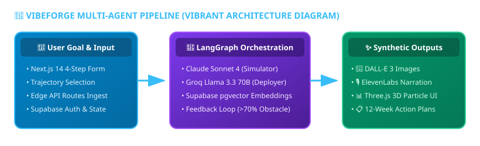
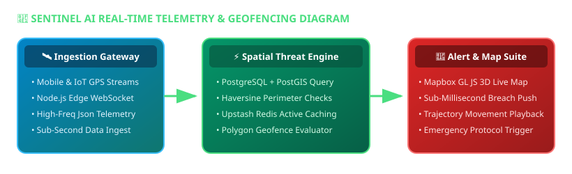

<div align="center">

<h3><code>ayush@github ~ $ whoami</code></h3>

<!-- AVI VASHISHTA BLOG STYLE: INFINITE SELF-DRAWING ASCII PORTRAIT + 3D WORDMARK SIDE BY SIDE -->
<table>
<tr>
<td valign="top" width="42%"></td>
<td valign="top" width="58%"></td>
</tr>
</table>

<br/>

<!-- EXECUTIVE BIO & DESCRIPTION -->
<p align="center">
  <b>Full-Stack &amp; AI Systems Engineer</b> based in <b>Kolkata, India 📍</b><br/>
  Architecting high-throughput geospatial tracking engines, multi-agent AI pipelines, and enterprise web applications.<br/>
  Specializing in <b>Next.js 14, LangGraph, Spring Boot 3.2, Supabase pgvector, and PostGIS</b>.
</p>

<br/>

<!-- OPTIMIZED & SHORTENED SOCIAL MEDIA BADGES -->
[](https://linkedin.com/in/edit-with-ayush)
[](https://x.com/anonymousx46x)
[](https://instagram.com/ayush.fillms)
[](https://reddit.com/user/Azzuroxx_09)

</div>

---

### 💻 `neofetch` --developer-summary

```syslog
  ██████╗  ██████╗  ██████╗ ███████╗     OS       : Arch Linux / macOS / Windows WSL2
  ██╔══██╗██╔═══██╗██╔════╝ ██╔════╝     Kernel   : Agentic AI CLI Ecosystem v2026.8
  ██████╔╝██║   ██║██║  ███╗█████╗       Uptime   : 24/7 Shipping Production Systems
  ██╔═══╝ ██║   ██║██║   ██║██╔══╝       Shell    : zsh + Antigravity CLI (AGY) + Claude Code + OpenCoder
  ██║     ╚██████╔╝╚██████╔╝███████╗     IDE      : Antigravity IDE / VS Code / Cursor
  ╚═╝      ╚═════╝  ╚═════╝ ╚══════╝     Location : Kolkata, India 📍
```

---

### 🛠️ Tech Stack & Skills Matrix (Categorized with Tech Names & Icons)

#### 🌐 **Languages**
[](https://www.typescriptlang.org)
[](https://www.oracle.com/java)
[](https://developer.mozilla.org)
[](https://www.python.org)
[](https://soliditylang.org)
[](https://www.postgresql.org)

#### 🎨 **Frontend & 3D Web**
[](https://nextjs.org)
[](https://react.dev)
[](https://tailwindcss.com)
[](https://threejs.org)
[](https://vitejs.dev)
[](https://getbootstrap.com)

#### ⚡ **Backend & Security**
[](https://nodejs.org)
[](https://spring.io/projects/spring-boot)
[](https://spring.io/projects/spring-security)
[](https://graphql.org)

#### 🧠 **AI & Multi-Agent Systems**
[](https://github.com/Ayushnot41)
[](https://anthropic.com)
[](https://github.com/Ayushnot41)
[](https://langchain-ai.github.io/langgraph/)
[](https://anthropic.com)
[](https://groq.com)

#### 🗄️ **Databases & DevOps**
[](https://supabase.com)
[](https://www.postgresql.org)
[](https://upstash.com)
[](https://vercel.com)
[](https://docker.com)
[](https://github.com/features/actions)

---

### 🚀 Major Projects & Repository Showcase

#### 🔮 **VibeForge** — *AI-Powered Future Self Simulator & Life Architect* (Priority #1)
> *Simulate parallel futures, visualize 3D timelines, and generate DALL-E 3 synthetic memories.*

<div align="center">
  
</div>

- **Features**: 3 parallel life trajectory simulations, automated time-travel obstacle feedback loop, 3D particle timeline, ElevenLabs voice narration, and 12-week deployment plans.
- **Tech Stack**: `Next.js 14`, `TypeScript`, `Tailwind CSS v4`, `LangGraph`, `Claude Sonnet 4`, `Groq Llama 3.3`, `Supabase pgvector`, `Three.js`, `ElevenLabs`, `Stripe`.

---

#### 📡 **Sentinel AI** — *Live Location Tracker & Threat Analytics* (Priority #2)
> *Real-time GPS telemetry ingestion, spatial geofencing, and sub-second alert dispatch.*

<div align="center">
  
</div>

- **Features**: Real-time location tracking, dynamic polygon geofencing, telemetry playback, and instantaneous perimeter threat notifications.
- **Tech Stack**: `Next.js 14`, `Node.js`, `WebSockets (Socket.io)`, `Mapbox GL`, `PostgreSQL + PostGIS`, `Tailwind CSS`.
- 💻 [GitHub Repository](https://github.com/Ayushnot41/Sentinel-AI)

---

#### 🤖 **agent-reach** — *Zero-Fee Multi-Platform AI Agent Web Scraper*
> *Give your AI agent eyes to search & read Twitter, Reddit, YouTube, GitHub, Bilibili, and XiaoHongShu without API fees.*

- **Features**: Multi-platform CLI scraper for AI agent workflows, zero API cost integration, structured JSON content outputs.
- **Tech Stack**: `Node.js`, `TypeScript`, `Puppeteer/Playwright`, `CLI`.
- 💻 [GitHub Repository](https://github.com/Ayushnot41/agent-reach)

---

#### 💼 **PayrollPro** — *Enterprise Salary & Tax Compliance SaaS*
> *Automating Indian salary computation, PF/ESI/TDS compliance, and tax regime comparisons.*

- **Features**: Real-time tax regime optimization (old vs new), automated PF/ESI/TDS calculations, interactive Recharts analytics, and bulk PDF/Excel exports.
- **Tech Stack**: `Next.js 14`, `TypeScript`, `Tailwind CSS`, `Zustand`, `Shadcn UI`, `Recharts`, `jsPDF`, `XLSX`.
- 🔗 [Live Application](https://payrolpro.vercel.app) · 💻 [GitHub Repository](https://github.com/Ayushnot41/payrolpro)

---

#### ⛓ **SkillBadge Verifier** — *Decentralized Soulbound Credential dApp*
> *On-chain Ethereum Sepolia verification platform for non-transferable soulbound credentials.*

- **Features**: Instant institution badge issuing, Soulbound NFT metadata generation, zero-fee verification interface, and MetaMask wallet synchronization.
- **Tech Stack**: `React 19`, `Vite`, `Solidity`, `ethers.js v6`, `Ethereum Sepolia`, `Framer Motion`.
- 🔗 [Live Application](https://skill-verifier2026.vercel.app) · 💻 [GitHub Repository](https://github.com/Ayushnot41/SkillVerifier2026)

---

#### 🏨 **Hotel Reservation System** — *Enterprise Java Booking Platform*
> *OTP-authenticated hotel booking portal covering 16+ Indian tourist destinations.*

- **Features**: Dual role-based dashboards (Admin & User), Fast2SMS OTP authentication, room inventory tracking, and Spring Security access rules.
- **Tech Stack**: `Java 17`, `Spring Boot 3.2`, `Spring Security`, `Thymeleaf`, `Bootstrap 5`, `H2 DB`, `Fast2SMS API`.
- 💻 [GitHub Repository](https://github.com/Ayushnot41/hotel-reservation-system)

---

#### ⚡ **ai-website-cloner-template** — *One-Command AI Coding Web Cloner*
> *Clone any website with one command using AI coding agents.*

- **Features**: Automated frontend component extraction, Tailwind CSS generator, agentic workflow templates.
- **Tech Stack**: `TypeScript`, `Node.js`, `AI Agent Prompts`.
- 💻 [GitHub Repository](https://github.com/Ayushnot41/ai-website-cloner-template)

---

#### 🧠 **500-ai-agents-projects** — *Curated Industry AI Agent Applications*
> *Comprehensive collection of 500+ practical AI Agent implementations across healthcare, finance, and software engineering.*

- 💻 [GitHub Repository](https://github.com/Ayushnot41/500-ai-agents-projects)

---

### 📊 GitHub Activity & Analytics

<div align="center">


</div>

---

<div align="center">

*Designed with CLI precision &amp; powered by Agentic AI*

</div>
