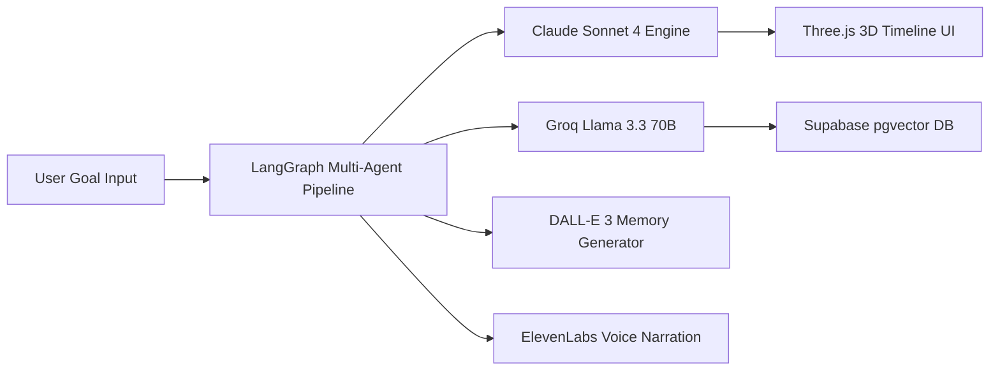
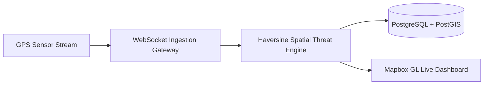

<div align="center">

<!-- ANIMATED TERMINAL HEADER BANNER (Avi Vashishta Blog Style SMIL/SVG Typing Animation) -->
<svg xmlns="http://www.w3.org/2000/svg" viewBox="0 0 850 210" width="100%" height="210" style="background: #0d1117; border-radius: 14px; border: 1px solid #30363d; font-family: 'Fira Code', 'Cascadia Code', 'Courier New', monospace;">
  <style>
    .prompt { fill: #38bdf8; font-weight: bold; font-size: 15px; }
    .command { fill: #4ade80; font-size: 15px; }
    .cursor { fill: #38bdf8; animation: blink 0.8s infinite; }
    .title { fill: #f8fafc; font-weight: bold; font-size: 26px; }
    .subtitle { fill: #94a3b8; font-size: 14px; }
    .highlight { fill: #c084fc; font-weight: 600; }

    @keyframes blink {
      0%, 100% { opacity: 1; }
      50% { opacity: 0; }
    }
  </style>

  <!-- Terminal Window Bar -->
  <rect x="0" y="0" width="850" height="34" rx="14" ry="14" fill="#161b22" />
  <circle cx="22" cy="17" r="6" fill="#ff5f56" />
  <circle cx="42" cy="17" r="6" fill="#ffbd2e" />
  <circle cx="62" cy="17" r="6" fill="#27c93f" />
  <text x="425" y="22" text-anchor="middle" fill="#8b949e" font-size="12" font-weight="500">ayush@antigravity-cli:~ (zsh)</text>

  <!-- Commands & Info -->
  <text x="30" y="72" class="prompt">❯ <tspan class="command">whoami --verbose</tspan></text>
  
  <text x="30" y="112" class="title">Ayush Sarkar</text>
  <text x="30" y="140" class="subtitle">AI Tools & Models Engineer | Full-Stack Architect | Multi-Agent Systems</text>
  
  <text x="30" y="178" class="prompt">❯ <tspan class="highlight">shipping --stack="Next.js 14, LangGraph, Supabase pgvector, Claude & Spring Boot"</tspan><tspan class="cursor">█</tspan></text>
</svg>

<br/><br/>

<!-- DYNAMIC TYPING SVG HEADER -->
<a href="https://git.io/typing-svg">
  
</a>

<br/><br/>

[](https://www.linkedin.com/in/edit-with-ayush)
[](https://github.com/Ayushnot41)
[](https://github.com/Ayushnot41)

</div>

---

### 💻 `neofetch` --developer-summary

```syslog
  ██████╗  ██████╗  ██████╗ ███████╗     OS       : Arch Linux / macOS / Windows WSL2
  ██╔══██╗██╔═══██╗██╔════╝ ██╔════╝     Kernel   : Agentic AI CLI Ecosystem v2026.8
  ██████╔╝██║   ██║██║  ███╗█████╗       Uptime   : 24/7 Shipping High-Scale Software
  ██╔═══╝ ██║   ██║██║   ██║██╔══╝       Shell    : zsh + Antigravity CLI (AGY) + Claude Code + OpenCoder
  ██║     ╚██████╔╝╚██████╔╝███████╗     IDE      : Antigravity IDE / VS Code / Cursor
  ╚═╝      ╚═════╝  ╚═════╝ ╚══════╝     Location : Kolkata, India 📍
```

---

### 🚀 Top Priority Projects

#### 🔮 **VibeForge** — *AI-Powered Future Self Simulator & Life Architect* (Priority #1)
> *Simulate parallel futures, visualize 3D timelines, and generate DALL-E 3 synthetic memories.*



- **Features**: 3 parallel life trajectory simulations, automated time-travel obstacle loop, 3D particle timeline, ElevenLabs voice narration, and 12-week deployment plans.
- **Tech Stack**: `Next.js 14`, `TypeScript`, `Tailwind CSS v4`, `LangGraph`, `Claude Sonnet 4`, `Groq Llama 3.3`, `Supabase pgvector`, `Three.js`, `ElevenLabs`, `Stripe`.

---

#### 📡 **Sentinel AI** — *Live Location Tracker & Threat Analytics* (Priority #2)
> *Real-time GPS telemetry ingestion, spatial geofencing, and sub-second alert dispatch.*



- **Features**: Real-time location tracking, dynamic polygon geofencing, telemetry playback, and instantaneous perimeter threat notifications.
- **Tech Stack**: `Next.js 14`, `Node.js`, `WebSockets (Socket.io)`, `Mapbox GL`, `PostgreSQL + PostGIS`, `Tailwind CSS`.
- 💻 [GitHub Repository](https://github.com/Ayushnot41/Sentinel-AI)

---

#### 💼 **PayrollPro** — *Enterprise Salary & Tax Compliance SaaS*
> *Automating Indian salary computation, PF/ESI/TDS compliance, and tax regime comparisons.*

- **Features**: Real-time tax regime optimization (old vs new), automated PF/ESI/TDS calculations, interactive Recharts analytics, and bulk PDF/Excel exports.
- **Tech Stack**: `Next.js 14`, `TypeScript`, `Tailwind CSS`, `Zustand`, `Shadcn UI`, `Recharts`, `jsPDF`, `XLSX`.
- 🔗 [Live Application](https://payrolpro.vercel.app) · 💻 [GitHub Repository](https://github.com/Ayushnot41/payrolpro)

---

#### ⛓ **SkillBadge Verifier** — *Decentralized Credential dApp*
> *On-chain Ethereum Sepolia verification platform for non-transferable soulbound credentials.*

- **Features**: Instant institution badge issuing, Soulbound NFT metadata generation, zero-fee verification interface, and MetaMask wallet synchronization.
- **Tech Stack**: `React 19`, `Vite`, `Solidity`, `ethers.js v6`, `Ethereum Sepolia`, `Framer Motion`.
- 🔗 [Live Application](https://skill-verifier2026.vercel.app) · 💻 [GitHub Repository](https://github.com/Ayushnot41/SkillVerifier2026)

---

#### 🏨 **Hotel Reservation System** — *Enterprise Java Booking Platform*
> *OTP-authenticated hotel booking portal covering 16+ Indian tourist destinations.*

- **Features**: Dual role-based dashboards (Admin & User), Fast2SMS OTP authentication, room inventory tracking, and Spring Security access rules.
- **Tech Stack**: `Java 17`, `Spring Boot 3.2`, `Spring Security`, `Thymeleaf`, `Bootstrap 5`, `H2 DB`, `Fast2SMS API`.
- 💻 [GitHub Repository](https://github.com/Ayushnot41/hotel-reservation-system)

---

### 🛠️ Tech Stack & Skills

<div align="center">

**Languages & Core Development**
<br/>


<br/><br/>

**Frontend & 3D Web**
<br/>


<br/><br/>

**Backend, Database & Cloud DevOps**
<br/>


</div>

---

### 📊 GitHub Activity & Analytics

<div align="center">


</div>

---

### ⚡ Agentic AI Engineering Philosophy

```
  ┌──────────────────┐      ┌──────────────────┐      ┌──────────────────┐
  │  Antigravity /   │ ───► │ High-Velocity    │ ───► │ Production-Grade │
  │  Claude Code CLI │      │ Architecture     │      │ Full-Stack Apps  │
  └──────────────────┘      └──────────────────┘      └──────────────────┘
```
- **High-Velocity AI Workflows**: Utilizing CLI-driven agentic systems (Google Antigravity, Claude Code, OpenCoder) to design schemas, structure agent graphs, and ship production software rapidly.
- **Enterprise Type Safety**: Strict TypeScript standards, Spring Security boundaries, and robust PostgreSQL schemas.
- **Next-Gen UX**: Combining vector databases, LLM orchestration, 3D graphics, and responsive design for modern AI products.

---

<div align="center">

**📫 Connect & Collaborate**

[](https://www.linkedin.com/in/edit-with-ayush)
[](https://x.com/anonymousx46x)
[](https://www.instagram.com/ayush.fillms)
[](https://www.reddit.com/user/Azzuroxx_09)

<br/>

*Crafted with CLI precision & powered by Agentic AI*

</div>
